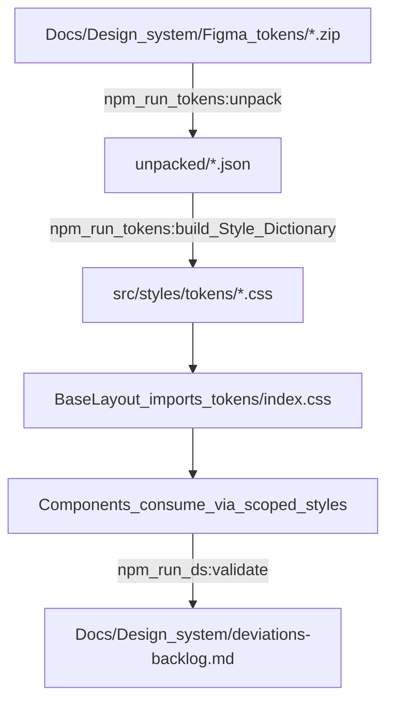

# Architecture

This document is the **how the site works and how to work with it** guide for AI agents and the site's owner. All content is verified against the actual codebase.

**Related docs:**
- Quick start: [`README.md`](./README.md)
- Token regeneration procedure: [`Agents/skills/design-tokens/SKILL.md`](../Agents/skills/design-tokens/SKILL.md)
- Durable token conventions: [`Agents/context/design-tokens.md`](../Agents/context/design-tokens.md)

## TL;DR

**Stack**: Astro 5 (static) + Vue 3 islands + Style Dictionary 4 token pipeline. Figma Material Theme Builder exports drive all color/typography/spacing/shape via CSS custom properties.

**Non-negotiables** (full details below):
1. Never hand-edit generated files in `src/styles/tokens/` — regenerate with `npm run tokens`
2. Never weaken lint rules to suppress design-system violations — fix root cause or log to backlog
3. Component styles: scoped blocks, token variables only, no inline styles or hardcoded values
4. Never remove the opacity/alpha regression guard in the token color transform
5. Build output (`../Export/site/`) is generated — write via `npm run build`, never hand-edit

**Key commands** (run in `Code/`):
- `npm run tokens` — Regenerate CSS custom properties from Figma exports
- `npm run dev` — Start dev server (localhost:4321)
- `npm run build` — Build to `../Export/site/`
- `npm run lint` — ESLint + Stylelint
- `npm run ds:validate` — Validate design-system compliance, update backlog

**Quick navigation**:
- Token pipeline architecture → [Token Pipeline](#token-pipeline)
- Opacity/alpha handling (critical) → [Opacity-Safe Color Transform](#2-opacity-safe-color-transform-critical)
- Styling rules → [Styling Rules](#styling-rules)
- Validation, lint, and the deviations backlog → [Design-System Validation](#design-system-validation)
- Component APIs and usage examples → [Component APIs](#component-apis)
- Image handling → [Image Handling](#image-handling)
- FOUC prevention → [FOUC Prevention](#fouc-prevention)
- Adding a case study → [Adding a New Case Study Page](#adding-a-new-case-study-page)

## Stack

- **Astro 5** — Static site generator, output: `static`
- **Vue 3** — Islands for client-side interactivity (theme toggle, lightbox)
- **Style Dictionary 4** — Token pipeline with W3C DTCG support
- **Sharp** — Image processing for responsive srcset + WebP conversion
- **TypeScript** — Type safety across components
- **Package manager:** npm
- **Build output:** `../Export/site/` (gitignored at repo root; regenerate with `npm run build`)

## Project Structure

```
Code/
├── package.json               # Dependencies and scripts
├── astro.config.mjs           # Astro config (static output, Vue, sharp, ../Export/site)
├── tsconfig.json              # TypeScript configuration
├── stylelint.config.js        # Stylelint rules (token enforcement)
├── eslint.config.js           # ESLint rules (Astro + Vue + TypeScript)
├── .prettierrc.json           # Prettier config
├── .gitignore                 # Ignores dist/, node_modules/, src/styles/tokens/
├── tokens/                    # Style Dictionary config + build scripts
│   ├── unpack.mjs             # Unzips Figma token exports to unpacked/
│   └── build.mjs              # Transforms DTCG tokens to CSS custom properties
├── scripts/
│   ├── ds-validate.mjs        # Design-system compliance validation
│   └── generate-placeholder.mjs  # Dev utility (raster image generator)
├── src/
│   ├── styles/
│   │   ├── tokens/            # GENERATED — never hand-edit (regenerate: `npm run tokens`)
│   │   │   ├── index.css      # Imports all token files
│   │   │   ├── _color.css     # 6 color modes (light/dark × default/medium/high contrast)
│   │   │   ├── _typescale.css # Editorial + UI typography
│   │   │   ├── _font.css      # Font family mappings
│   │   │   ├── _shape.css     # Corner radii
│   │   │   └── _spacing.css   # Editorial spacing ONLY (no component padding)
│   │   ├── global.css         # Minimal universal styles (reset, base type, selection)
│   │   └── fonts.css          # Self-hosted @fontsource imports
│   ├── layouts/
│   │   ├── BaseLayout.astro   # Foundation layout (head, theme, FOUC prevention)
│   │   └── CaseStudyLayout.astro  # Case study wrapper (title block, nav)
│   ├── components/
│   │   ├── Section.astro      # Semantic section wrapper
│   │   ├── Container.astro    # Max-width content wrapper
│   │   ├── Prose.astro        # Editorial content wrapper (vertical rhythm)
│   │   ├── Figure.astro       # Image wrapper (astro:assets integration)
│   │   ├── Button.astro       # Button/link (3 variants)
│   │   ├── Tag.astro          # Small pill label
│   │   ├── ThemeToggle.vue    # Light/dark toggle (Vue island)
│   │   └── Lightbox.vue       # Full-screen image viewer (Vue island)
│   ├── pages/
│   │   ├── index.astro        # Home page
│   │   └── work/              # Hand-built case study pages (no MDX/content collections)
│   └── assets/                # Images (processed by astro:assets)
└── ../Export/site/            # Build output (gitignored at repo root)
```

## Token Pipeline

The design system is built on W3C DTCG tokens exported from Figma's Material Theme Builder. Tokens are the single source of truth for color, typography, spacing, and shape.



### Commands

| Command | Action |
| --- | --- |
| `npm run tokens:unpack` | Unzips `Docs/Design system/Figma tokens/*.zip` into `unpacked/` (tracked for diffing) |
| `npm run tokens:build` | Runs Style Dictionary to generate `src/styles/tokens/*.css` |
| `npm run tokens` | Unpack + build (use after new Figma export) |

### Generated Token Files

All files in `src/styles/tokens/` are **build artifacts** (gitignored). Never hand-edit. Regenerate with `npm run tokens`.

- **`_color.css`** — 6 color modes:
  - Light (default): `:root`
  - Dark: `:root[data-theme="dark"]`
  - Medium contrast: `:root[data-contrast="medium"]` (generated, not yet wired to UI)
  - High contrast: `:root[data-contrast="high"]` (generated, not yet wired to UI)
  - Dark + medium: `:root[data-theme="dark"][data-contrast="medium"]`
  - Dark + high: `:root[data-theme="dark"][data-contrast="high"]`
- **`_typescale.css`** — Editorial and UI typography (font-size, line-height, letter-spacing, weight, font-family)
- **`_font.css`** — `--md-ref-font-brand|plain|mono` mapped to self-hosted fonts (Platypi, Instrument Sans, IBM Plex Mono)
- **`_shape.css`** — Corner radii (none → extra-extra-large → full)
- **`_spacing.css`** — **Editorial spacing ONLY**: `eyebrow-to-title`, `body-to-section`, etc. **No component-level padding tokens exist.**
- **`index.css`** — Imports all of the above; imported globally by `BaseLayout`

### Token Namespace

All generated tokens follow MD3-style naming with kebab-case:

- `--md-sys-color-*` (primary, on-primary, surface, background, etc.)
- `--md-sys-color-state-layers-*-opacity-*` (hover/active/focus overlays)
- `--md-sys-typescale-*` (display, headline, title, body, label)
- `--md-sys-typescale-*-size|line-height|tracking|weight|font` (individual props)
- `--md-sys-shape-corner-*` (none, extra-small, small, medium, large, extra-large, extra-extra-large, full)
- `--md-sys-spacing-*` (editorial only)
- `--md-ref-font-*` (brand, plain, mono)

To discover exact token names, read the generated CSS files in `src/styles/tokens/`.

### Custom Transforms (Critical)

#### 1. Kebab-case Name Transform

Figma tokens contain spaces and mixed casing. The build transforms to kebab-case and adds MD3-style prefixes:

- `On Primary` → `--md-sys-color-on-primary`
- `Byline to Body` → `--md-sys-spacing-byline-to-body`
- `Extra-large-increased` → `--md-sys-shape-corner-extra-large-increased`

#### 2. Opacity-Safe Color Transform (CRITICAL)

**This is the most important gotcha in the entire pipeline.**

Figma DTCG color tokens have this structure:

```json
{
  "$value": {
    "colorSpace": "srgb",
    "components": { "red": 0.168, "green": 0.388, "blue": 0.545 },
    "alpha": 0.08,
    "hex": "#2B638B"
  }
}
```

**The `hex` field is 6-digit RGB ONLY.** Opacity lives in the separate `alpha` field.

**The Bug:**
A naive transform that reads only `hex` will **silently drop opacity**. This affects **152 distinct tokens per color mode**, emitted across all 6 modes for **912 total declarations** (verified in the current build):
- All **State Layers** (every role × Opacity-08/10/16) used for hover/active/focus states
- All **Surface Tints** (5%, 8%, 11%, 12%, 14%) used for surface elevation

This makes interactive states invisible or wrong.

**Our Solution:**
The custom color transform in `tokens/build.mjs`:
- If `alpha === 1` → emit `hex` (e.g. `#2B638B`)
- If `alpha < 1` → emit modern `rgb(r g b / a)` syntax:
  - Extract RGB from `components` (float 0–1 → ×255, round)
  - Use raw `alpha` for slash-alpha
  - Example: `rgb(43 99 139 / 0.08)`

**The Regression Guard:**
The build includes an assertion that fails if any token with `alpha < 1` produces output without an alpha channel. The guard currently verifies 912 alpha-bearing declarations (152 tokens × 6 modes). This prevents:
- Future token exports from reintroducing the bug
- Style Dictionary upgrades from breaking the transform
- Accidental refactoring from dropping alpha

**Never remove or bypass this guard.** If it fails, fix the transform, don't weaken the check.

## Styling Rules

### Scoped Styles

All component styles are **scoped** (Astro `<style>` or Vue `<style scoped>`). Global styles live in `src/styles/global.css` and are **minimal**: modern reset, `:root` font smoothing, base `body`/heading type, link/selection defaults. No component-level styling in `global.css`.

**Why scoped CSS instead of web components or styled-components:**
Web Components were evaluated and rejected because they don't fit Astro's static-first model (require runtime JS for styling, shadow DOM complicates SEO/a11y). Styled-components (CSS-in-JS) were rejected for performance (runtime cost, no SSR style extraction in Astro). Scoped CSS with token consumption provides type safety via validation without runtime overhead.

### Token Consumption

All color, spacing, border-radius, font-family, font-size, line-height, letter-spacing, and font-weight **must** use token variables. No literals allowed (enforced by Stylelint + `ds-validate.mjs`).

```css
/* Correct */
.button {
  color: var(--md-sys-color-on-primary);
  background-color: var(--md-sys-color-primary);
  padding: var(--md-sys-spacing-body-to-subsection);
  border-radius: var(--md-sys-shape-corner-large);
  font-size: var(--md-sys-typescale-label-large-size);
}

/* Forbidden */
.button {
  color: #2B638B;                /* hardcoded color */
  padding: 1rem 2rem;            /* raw spacing */
  border-radius: 16px;           /* raw radius */
  font-size: 16px;               /* raw font size */
}
```

**Exception:** `src/styles/fonts.css` is exempt from token enforcement (needs raw values for `@font-face` declarations).

### FOUC Prevention

The theme toggle uses a two-step approach to avoid flash of unstyled content:

1. **Inline script in `BaseLayout.astro`** (runs BEFORE first paint):
   ```js
   const stored = localStorage.getItem('theme');
   const prefersDark = window.matchMedia('(prefers-color-scheme: dark)').matches;
   const theme = stored || (prefersDark ? 'dark' : 'light');
   document.documentElement.setAttribute('data-theme', theme);
   ```

2. **`ThemeToggle.vue` syncs on mount**, reading the current `data-theme` from `:root` and updating internal state to match.

## Design-System Validation

Automated validation enforces the styling rules above, catching drift before it compounds.

### Tools

- **Stylelint** with `stylelint-declaration-strict-value` — Forces color/spacing/radius/font props to use `var(--md-…)` instead of literals
- **ESLint** (Astro + Vue + TypeScript plugins) + Prettier — Standard linting + formatting
- **`scripts/ds-validate.mjs`** — Custom script scanning `src/**` for deviations. Enforces:
  - `hardcoded-color` — Color property uses literal hex/rgb/hsl/named color instead of `var(--md-…)`
  - `raw-spacing` — Spacing property (margin/padding/gap) uses raw length instead of `var(--md-sys-spacing-…)`
  - `raw-border-radius` — Border-radius uses raw length instead of `var(--md-sys-shape-corner-…)`
  - `non-token-font-family` — font-family must use `var(--md-ref-font-…)` or typescale font vars
  - `raw-font-size` — font-size uses raw length instead of `var(--md-sys-typescale-…)`
  - `non-md-token` — CSS variable is not from MD3 token namespace (`--md-sys-*` / `--md-ref-*`)
  - `global-component-leak` — Component-level selector or styling detected in `global.css`

### Commands

| Command | Action |
| --- | --- |
| `npm run lint` | ESLint + Stylelint |
| `npm run ds:validate` | Custom validation, updates `Docs/Design system/deviations-backlog.md` |
| `npm run ds:validate -- --strict` | For CI: fails (exit 1) if any deviations exist |

### Known Deviations (4 legitimate exceptions as of 2026-08-28)

Current deviations backlog: [`Docs/Design system/deviations-backlog.md`](../Docs/Design%20system/deviations-backlog.md)

| File | Line | Rule | Reason |
| --- | --- | --- | --- |
| `src/components/Button.astro` | 49 | `raw-spacing` | Button padding `0.625rem 1.5rem` — no component-level padding token exists |
| `src/components/Prose.astro` | 107 | `raw-spacing` | Inline code padding `0.125em 0.375em` — no component-level padding token exists |
| `src/components/Tag.astro` | 24 | `raw-spacing` | Tag padding `0.25rem 0.75rem` — no component-level padding token exists |
| `src/components/Lightbox.vue` | 171 | `hardcoded-color` | Backdrop `rgb(0 0 0 / 0.9)` — no 90%-opacity scrim token exists in MD3 |

**Root cause:** The Figma spacing collection contains **only editorial/document-flow tokens** (see `src/styles/tokens/_spacing.css`). No component-level padding scale exists. The Figma color system also lacks a scrim token near 90% opacity (the closest Surface Tints are at 5–14%).

**Correct fix (do not implement without explicit user request):** Add component padding tokens and scrim tokens to Figma and re-export. Documented in [`Docs/Design system/deviations-backlog.md`](../Docs/Design%20system/deviations-backlog.md).

**Never weaken lint rules or invent local tokens to make these violations disappear.** They remain as documented legitimate exceptions until the token system is extended.

## Image Handling

Images use Astro's `astro:assets` pipeline via the `Figure` component.

### Workflow

1. **Place raster images** in `src/assets/` (JPG, PNG — not SVG, see below)
2. **Import** in your component:
   ```astro
   import myImage from '../assets/myImage.jpg';
   ```
3. **Use `Figure`**:
   ```astro
   <Figure
     src={myImage}
     alt="Description"
     caption="Optional caption"
     credit="Optional credit"
   />
   ```

`Figure` automatically:
- Generates responsive `srcset` at multiple widths (default: 640, 768, 1024, 1280, 1536)
- Converts to WebP format for browsers that support it
- Lazy loads images by default
- Provides proper `sizes` attribute

### SVG vs Raster Gotcha

**Sharp does not resize or convert SVGs.** If you import an SVG (e.g. `placeholder.svg`), the `astro:assets` pipeline will **not** generate responsive srcset or WebP variants. The SVG passes through unchanged.

To exercise the full responsive pipeline, **always use raster sources** (JPG, PNG). Example: `placeholder-raster.jpg` generates 6 sizes + WebP; `placeholder.svg` does not.

## Component APIs

### Layouts

#### BaseLayout

Foundation layout for all pages. Provides `<head>`, global CSS, FOUC prevention, and slots.

**Props:**
- `title` (string, required) — Page title (auto-suffixes " | Morgan Keys" unless title is "Morgan Keys")
- `description` (string, optional, default: "Product designer & creative technologist")
- `canonicalURL` (URL, optional)

**Slots:**
- `head` (optional) — Additional `<head>` content
- Default slot — Page content

**Usage:**
```astro
<BaseLayout title="About" description="About Morgan Keys">
  <main>...</main>
</BaseLayout>
```

#### CaseStudyLayout

Extends `BaseLayout` for case study pages. Provides title block, meta, and next/prev navigation.

**Props:**
- `title` (string, required) — Case study title
- `eyebrow` (string, optional) — Client/project name
- `standfirst` (string, optional) — Brief description
- `byline` (string, optional) — Role and year
- `tags` (string[], optional, default: `[]`) — Category tags
- `description` (string, optional) — Meta description
- `nextStudy` (object, optional) — `{ href: string, title: string }`
- `prevStudy` (object, optional) — `{ href: string, title: string }`

**Slots:**
- Default slot — Case study body (compose from primitives)

**Usage:**
```astro
<CaseStudyLayout
  title="Project Name"
  eyebrow="Client"
  standfirst="Brief description"
  byline="Principal Designer · 2024"
  tags={['UX', 'Engineering']}
  nextStudy={{ href: '/work/next', title: 'Next Project' }}
>
  <Section>...</Section>
</CaseStudyLayout>
```

### Primitives

#### Section

Semantic top-level section wrapper with vertical rhythm (`padding-block: var(--md-sys-spacing-body-to-section)`).

**Props:**
- `as` (string, default: `'section'`) — Polymorphic element (section | div | article | aside | nav)
- `class` (string, optional) — Additional CSS class

**Usage:**
```astro
<Section>
  <Container>...</Container>
</Section>
```

#### Container

Horizontal content wrapper with max-width and responsive padding.

**Props:**
- `size` (string, default: `'default'`) — Max-width variant:
  - `'default'`: 80rem
  - `'narrow'`: 60rem
  - `'wide'`: 100rem
- `class` (string, optional)

**Usage:**
```astro
<Container size="narrow">
  <Prose>...</Prose>
</Container>
```

#### Prose

Editorial content wrapper applying vertical rhythm to child elements (headings, paragraphs, lists, blockquotes, code). Use for long-form text content.

**Props:**
- `class` (string, optional)

**Usage:**
```astro
<Prose>
  <h2>Heading</h2>
  <p>Body text...</p>
  <ul>
    <li>Item</li>
  </ul>
</Prose>
```

#### Figure

Image wrapper using `astro:assets` for responsive images.

**Props:**
- `src` (ImageMetadata, required) — Imported image from `src/assets/`
- `alt` (string, required) — Alt text
- `caption` (string, optional) — Image caption
- `credit` (string, optional) — Image credit
- `widths` (number[], optional, default: `[640, 768, 1024, 1280, 1536]`) — Responsive widths
- `sizes` (string, optional, default: `'(max-width: 768px) 100vw, 80vw'`) — Sizes attribute
- `loading` ('lazy' | 'eager', optional, default: `'lazy'`)
- `class` (string, optional)

**Usage:**
```astro
<Figure
  src={importedImage}
  alt="Description"
  caption="Caption"
  credit="Credit"
  widths={[640, 1024, 1536]}
  loading="eager"
/>
```

#### Button

Semantic button/link component with 3 variants.

**Props:**
- `variant` ('filled' | 'outlined' | 'text', default: `'filled'`)
- `as` ('button' | 'a', default: `'button'`)
- `href` (string, optional) — Link target (required if `as="a"`)
- `type` ('button' | 'submit' | 'reset', optional, default: `'button'`) — Button type (only if `as="button"`)
- `class` (string, optional)

**Usage:**
```astro
<!-- Button -->
<Button variant="filled" type="submit">Submit</Button>

<!-- Link styled as button -->
<Button variant="outlined" as="a" href="/about">Learn More</Button>
```

#### Tag

Small pill-shaped label for categorization.

**Props:**
- `class` (string, optional)

**Slots:**
- Default slot — Tag text

**Usage:**
```astro
<Tag>Design Systems</Tag>
```

### Vue Islands

Vue components hydrated on the client. Always specify a `client:*` directive.

#### ThemeToggle

Light/dark theme toggle button.

**Props:** None

**Usage:**
```astro
<ThemeToggle client:load />
```

**Behavior:**
- Toggles `data-theme="light|dark"` on `:root`
- Persists to `localStorage.theme`
- Syncs with system preference if no stored value

#### Lightbox

Full-screen image viewer with keyboard navigation.

**Props:**
- `images` (array, required) — `Array<{ src: string, alt: string, caption?: string }>`

**Usage:**
```astro
<Lightbox
  client:idle
  images={[
    { src: '/path/to/image1.jpg', alt: 'Image 1', caption: 'Caption 1' },
    { src: '/path/to/image2.jpg', alt: 'Image 2' },
  ]}
/>
```

**Features:**
- Click backdrop or press Escape to close
- Arrow keys for prev/next
- Image counter (e.g. "2 / 5")
- Prevents body scroll when open

**Hydration:** Use `client:idle` (defers until page is interactive) or `client:visible` (loads when scrolled into view). Avoid `client:load` unless needed immediately.

## Adding a New Case Study Page

1. **Create file** in `src/pages/work/` (e.g. `my-study.astro`)
2. **Import components** and image assets:
   ```astro
   import CaseStudyLayout from '../../layouts/CaseStudyLayout.astro';
   import Section from '../../components/Section.astro';
   import Container from '../../components/Container.astro';
   import Prose from '../../components/Prose.astro';
   import Figure from '../../components/Figure.astro';
   import myImage from '../../assets/my-image.jpg';
   ```
3. **Compose page** from primitives:
   ```astro
   <CaseStudyLayout
     title="My Case Study"
     eyebrow="Client Name"
     standfirst="Brief description"
     byline="Role · Year"
     tags={['Tag1', 'Tag2']}
   >
     <Section>
       <Container>
         <Prose>
           <h2>Section Heading</h2>
           <p>Body text...</p>
         </Prose>
       </Container>
     </Section>

     <Section>
       <Container size="wide">
         <Figure src={myImage} alt="Description" caption="Caption" />
       </Container>
     </Section>
   </CaseStudyLayout>
   ```
4. **Run validation** after styling: `npm run ds:validate`
5. **Test build**: `npm run build && npm run preview`

**Do not use MDX or content collections.** Case studies are hand-built per-study page components for maximum layout flexibility.

## Build and Development Workflow

### Commands Reference

| Command | Description | Notes |
| --- | --- | --- |
| `npm install` | Install dependencies | Run once after clone |
| `npm run tokens` | Regenerate tokens from Figma exports | Runs `tokens:unpack` + `tokens:build` |
| `npm run dev` | Start dev server | http://localhost:4321 (no telemetry env var) |
| `npm run build` | Build for production | Runs `tokens` first, disables Astro telemetry |
| `npm run preview` | Preview production build | Runs after `build` |
| `npm run lint` | ESLint + Stylelint | Fix: `npm run format` |
| `npm run format` | Prettier format | Auto-fixes formatting |
| `npm run ds:validate` | Design-system validation | Updates backlog, exit 0 |
| `npm run ds:validate -- --strict` | Strict validation for CI | Exit 1 if deviations exist |

### Gotcha: Astro Telemetry Environment Variable

The `build` script sets `ASTRO_TELEMETRY_DISABLED=1` but `dev` does not. In restricted/sandboxed environments, telemetry can cause `dev` to fail or hang. If this occurs, either:
- Add `ASTRO_TELEMETRY_DISABLED=1` prefix to the `dev` script in `package.json`, or
- Set `ASTRO_TELEMETRY_DISABLED=1` in your shell environment

The current setup leaves `dev` without the env var for local convenience; add it if needed for your environment.

### Typical Workflow

**After a new Figma token export:**
```bash
cd Code/
npm run tokens           # Unpack + build
git diff src/styles/tokens/  # Review changes
npm run ds:validate      # Check for new deviations
npm run build            # Verify build passes
npm run preview          # Test locally
```

**Before committing component changes:**
```bash
npm run lint             # Catch linting errors
npm run ds:validate      # Verify token compliance
npm run build            # Ensure build succeeds
```

## Maintenance

### When to Regenerate Tokens

Regenerate tokens when:
1. New Figma token export arrives in `Docs/Design system/Figma tokens/*.zip`
2. Token structure changes (add/remove/rename tokens)
3. After updating Style Dictionary config in `tokens/build.mjs`

Always run `npm run tokens`, review `git diff src/styles/tokens/`, and run `npm run ds:validate` after regeneration.

### Adding New Components

1. Create `.astro` or `.vue` file in `src/components/`
2. Use **scoped styles** (`<style>` or `<style scoped>`)
3. Consume **only token variables** for color/spacing/radius/typography
4. Run `npm run ds:validate` to verify compliance
5. Update this document's **Component APIs** section with props/slots/usage

### Clearing the Deviations Backlog

The 4 current deviations are **legitimate exceptions** requiring new tokens in Figma:
- Component-level padding tokens (button, tag, inline code)
- Scrim token near 90% opacity (lightbox backdrop)

**Do not:**
- Invent local tokens to work around missing tokens
- Weaken lint rules to suppress violations
- Manually edit the backlog to hide violations

**Do:**
- Document the rationale in the backlog
- Request token additions from the design system owner
- Re-export from Figma and run `npm run tokens` when new tokens arrive
- Update affected components and re-validate

### Updating Documentation

- **`Code/ARCHITECTURE.md`** (this file) — Structure, token flow, styling rules, component APIs. Optimized for AI agents; verified against codebase.
- **`Code/README.md`** — Quick-start guide for running the project. Human-friendly overview.
- **`Agents/context/design-tokens.md`** — Durable token conventions (opacity gotcha, naming, modes). Load before modifying token transforms.
- **`Agents/skills/design-tokens/SKILL.md`** — Token regeneration procedure. Invoke when regenerating tokens or validating design-system compliance.

Keep `ARCHITECTURE.md` accurate by verifying all claims against the real codebase before editing. If you find drift, fix the doc, not the code (unless the code is wrong).
