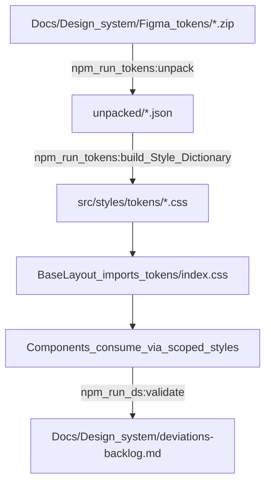

# Architecture

This document is the **how the site works and how to work with it** guide for AI agents and the site's owner. All content is verified against the actual codebase.

**Related docs:**
- Quick start: [`README.md`](./README.md)
- Token regeneration procedure: [`Agents/skills/design-tokens/SKILL.md`](../Agents/skills/design-tokens/SKILL.md)
- Durable token conventions: [`Agents/context/design-tokens.md`](../Agents/context/design-tokens.md)

## TL;DR

**Stack**: Astro 5 (static) + Vue 3 islands + Style Dictionary 4 token pipeline. Figma Material Theme Builder exports drive all color/typography/spacing/shape via CSS custom properties.

**Non-negotiables** (full details below):
1. Never hand-edit generated files in `src/styles/tokens/` — regenerate with `npm run tokens`
2. Never weaken lint rules to suppress design-system violations — fix root cause or log to backlog
3. Component styles: scoped blocks, token variables only, no inline styles or hardcoded values
4. Never remove the opacity/alpha regression guard in the token color transform
5. Build output (`dist/`) is generated — write via `npm run build`, never hand-edit

**Key commands** (run in `Code/`):
- `npm run tokens` — Regenerate CSS custom properties from Figma exports
- `npm run dev` — Start dev server (localhost:4321)
- `npm run build` — Build to `dist/`
- `npm run lint` — ESLint + Stylelint
- `npm run ds:validate` — Validate design-system compliance, update backlog

**Quick navigation**:
- Token pipeline architecture → [Token Pipeline](#token-pipeline)
- Opacity/alpha handling (critical) → [Opacity-Safe Color Transform](#2-opacity-safe-color-transform-critical)
- Styling rules → [Styling Rules](#styling-rules)
- Validation, lint, and the deviations backlog → [Design-System Validation](#design-system-validation)
- Component APIs and usage examples → [Component APIs](#component-apis)
- Image handling → [Image Handling](#image-handling)
- FOUC prevention → [FOUC Prevention](#fouc-prevention)
- Adding a case study → [Adding a New Case Study Page](#adding-a-new-case-study-page)
- Zooming an image full-screen → [Image Zoom](#image-zoom)

## Stack

- **Astro 5** — Static site generator, output: `static`
- **Vue 3** — Islands for client-side interactivity (theme toggle, lightbox)
- **Style Dictionary 4** — Token pipeline with W3C DTCG support
- **Sharp** — Image processing for responsive srcset + WebP conversion
- **TypeScript** — Type safety across components
- **Package manager:** npm
- **Build output:** `dist/` (gitignored; regenerate with `npm run build`)

## Project Structure

```
Code/
├── package.json               # Dependencies and scripts
├── astro.config.mjs           # Astro config (static output, Vue, sharp, dist/)
├── tsconfig.json              # TypeScript configuration
├── stylelint.config.js        # Stylelint rules (token enforcement)
├── eslint.config.js           # ESLint rules (Astro + Vue + TypeScript)
├── .prettierrc.json           # Prettier config
├── .gitignore                 # Ignores dist/, node_modules/, src/styles/tokens/
├── tokens/                    # Style Dictionary config + build scripts
│   ├── unpack.mjs             # Unzips Figma token exports to unpacked/
│   └── build.mjs              # Transforms DTCG tokens to CSS custom properties
├── scripts/
│   ├── ds-validate.mjs        # Design-system compliance validation
│   └── generate-placeholder.mjs  # Dev utility (raster image generator)
├── src/
│   ├── styles/
│   │   ├── tokens/            # GENERATED — never hand-edit (regenerate: `npm run tokens`)
│   │   │   ├── index.css      # Imports all token files
│   │   │   ├── _color.css     # 6 color modes (light/dark × default/medium/high contrast)
│   │   │   ├── _typescale.css # Editorial + UI typography
│   │   │   ├── _font.css      # Font family mappings
│   │   │   ├── _shape.css     # Corner radii
│   │   │   └── _spacing.css   # Editorial spacing ONLY (no component padding)
│   │   ├── global.css         # Minimal universal styles (reset, base type, selection)
│   │   └── fonts.css          # Self-hosted @fontsource imports
│   ├── lib/                   # Framework-free helpers shared by components
│   │   ├── crop.ts            # Figma image-crop transform (zoom + pan)
│   │   ├── tone.ts            # CardTone union (resolves brand.css tone properties)
│   │   └── case-studies/      # Case-study registry (one source for card + overlay)
│   ├── scripts/
│   │   └── case-study-overlay.ts  # Opens/closes case-study <dialog> overlays
│   ├── layouts/
│   │   ├── BaseLayout.astro   # Foundation layout (head, theme, FOUC prevention)
│   │   └── CaseStudyLayout.astro  # Case study wrapper (title block, nav)
│   ├── components/
│   │   ├── case-study/        # Blocks composing an overlay body
│   │   ├── case-studies/      # One fragment per case study (body markup only)
│   │   ├── Section.astro      # Semantic section wrapper
│   │   ├── Container.astro    # Max-width content wrapper
│   │   ├── Prose.astro        # Editorial content wrapper (vertical rhythm)
│   │   ├── Figure.astro       # Image wrapper (astro:assets integration)
│   │   ├── Button.astro       # Button/link (3 variants)
│   │   ├── Tag.astro          # Small pill label
│   │   ├── ThemeToggle.vue    # System/dark/light color mode toggle (Vue island)
│   │   └── Lightbox.vue       # Full-screen image viewer (Vue island)
│   ├── pages/
│   │   ├── index.astro        # Home page
│   │   ├── dev/               # Dev-only component specimens (excluded from production)
│   │   └── work/              # Hand-built case study pages (no MDX/content collections)
│   └── assets/                # Images (processed by astro:assets)
└── dist/                      # Build output (gitignored; regenerate with `npm run build`)
```

## Token Pipeline

The design system is built on W3C DTCG tokens exported from Figma's Material Theme Builder. Tokens are the single source of truth for color, typography, spacing, and shape.



### Commands

| Command | Action |
| --- | --- |
| `npm run tokens:unpack` | Unzips `Docs/Design system/Figma tokens/*.zip` into `unpacked/` (tracked for diffing) |
| `npm run tokens:build` | Runs Style Dictionary to generate `src/styles/tokens/*.css` |
| `npm run tokens` | Unpack + build (use after new Figma export) |

### Generated Token Files

All files in `src/styles/tokens/` are **build artifacts** (gitignored). Never hand-edit. Regenerate with `npm run tokens`.

- **`_color.css`** — 6 color modes:
  - Light (default): `:root`
  - Dark: `:root[data-theme="dark"]`
  - Medium contrast: `:root[data-contrast="medium"]` (generated, not yet wired to UI)
  - High contrast: `:root[data-contrast="high"]` (generated, not yet wired to UI)
  - Dark + medium: `:root[data-theme="dark"][data-contrast="medium"]`
  - Dark + high: `:root[data-theme="dark"][data-contrast="high"]`
- **`_typescale.css`** — Editorial and UI typography (font-size, line-height, letter-spacing, weight, font-family)
- **`_font.css`** — `--md-ref-font-brand|plain|mono` mapped to self-hosted fonts (Platypi, Instrument Sans, IBM Plex Mono)
- **`_shape.css`** — Corner radii (none → extra-extra-large → full)
- **`_spacing.css`** — **Editorial spacing ONLY**: `eyebrow-to-title`, `body-to-section`, etc. **No component-level padding tokens exist.**
- **`index.css`** — Imports all of the above; imported globally by `BaseLayout`

### Token Namespace

All generated tokens follow MD3-style naming with kebab-case:

- `--md-sys-color-*` (primary, on-primary, surface, background, etc.)
- `--md-sys-color-state-layers-*-opacity-*` (hover/active/focus overlays)
- `--md-sys-typescale-*` (display, headline, title, body, label)
- `--md-sys-typescale-*-size|line-height|tracking|weight|font` (individual props)
- `--md-sys-shape-corner-*` (none, extra-small, small, medium, large, extra-large, extra-extra-large, full)
- `--md-sys-spacing-*` (editorial only)
- `--md-ref-font-*` (brand, plain, mono)

To discover exact token names, read the generated CSS files in `src/styles/tokens/`.

### Custom Transforms (Critical)

#### 1. Kebab-case Name Transform

Figma tokens contain spaces and mixed casing. The build transforms to kebab-case and adds MD3-style prefixes:

- `On Primary` → `--md-sys-color-on-primary`
- `Byline to Body` → `--md-sys-spacing-byline-to-body`
- `Extra-large-increased` → `--md-sys-shape-corner-extra-large-increased`

#### 2. Opacity-Safe Color Transform (CRITICAL)

**This is the most important gotcha in the entire pipeline.**

Figma DTCG color tokens have this structure:

```json
{
  "$value": {
    "colorSpace": "srgb",
    "components": { "red": 0.168, "green": 0.388, "blue": 0.545 },
    "alpha": 0.08,
    "hex": "#2B638B"
  }
}
```

**The `hex` field is 6-digit RGB ONLY.** Opacity lives in the separate `alpha` field.

**The Bug:**
A naive transform that reads only `hex` will **silently drop opacity**. This affects **152 distinct tokens per color mode**, emitted across all 6 modes for **912 total declarations** (verified in the current build):
- All **State Layers** (every role × Opacity-08/10/16) used for hover/active/focus states
- All **Surface Tints** (5%, 8%, 11%, 12%, 14%) used for surface elevation

This makes interactive states invisible or wrong.

**Our Solution:**
The custom color transform in `tokens/build.mjs`:
- If `alpha === 1` → emit `hex` (e.g. `#2B638B`)
- If `alpha < 1` → emit modern `rgb(r g b / a)` syntax:
  - Extract RGB from `components` (float 0–1 → ×255, round)
  - Use raw `alpha` for slash-alpha
  - Example: `rgb(43 99 139 / 0.08)`

**The Regression Guard:**
The build includes an assertion that fails if any token with `alpha < 1` produces output without an alpha channel. The guard currently verifies 912 alpha-bearing declarations (152 tokens × 6 modes). This prevents:
- Future token exports from reintroducing the bug
- Style Dictionary upgrades from breaking the transform
- Accidental refactoring from dropping alpha

**Never remove or bypass this guard.** If it fails, fix the transform, don't weaken the check.

## Styling Rules

### Scoped Styles

All component styles are **scoped** (Astro `<style>` or Vue `<style scoped>`). Global styles live in `src/styles/global.css` and are **minimal**: modern reset, `:root` font smoothing, base `body`/heading type, link/selection defaults. No component-level styling in `global.css`.

**Why scoped CSS instead of web components or styled-components:**
Web Components were evaluated and rejected because they don't fit Astro's static-first model (require runtime JS for styling, shadow DOM complicates SEO/a11y). Styled-components (CSS-in-JS) were rejected for performance (runtime cost, no SSR style extraction in Astro). Scoped CSS with token consumption provides type safety via validation without runtime overhead.

### Token Consumption

All color, spacing, border-radius, font-family, font-size, line-height, letter-spacing, and font-weight **must** use token variables. No literals allowed (enforced by Stylelint + `ds-validate.mjs`).

```css
/* Correct */
.button {
  color: var(--md-sys-color-on-primary);
  background-color: var(--md-sys-color-primary);
  padding: var(--md-sys-spacing-body-to-subsection);
  border-radius: var(--md-sys-shape-corner-large);
  font-size: var(--md-sys-typescale-label-large-size);
}

/* Forbidden */
.button {
  color: #2B638B;                /* hardcoded color */
  padding: 1rem 2rem;            /* raw spacing */
  border-radius: 16px;           /* raw radius */
  font-size: 16px;               /* raw font size */
}
```

**Exception:** `src/styles/fonts.css` is exempt from token enforcement (needs raw values for `@font-face` declarations).

### FOUC Prevention

The theme toggle uses a two-step approach to avoid flash of unstyled content:

1. **Inline script in `BaseLayout.astro`** (runs BEFORE first paint): uses `localStorage.theme`
   when it is `dark` or `light`; otherwise ("system") resolves from `prefers-color-scheme`.
   It also listens for OS preference changes, so System mode updates live on every page,
   including pages without the toggle.

2. **`ThemeToggle.vue` syncs on mount**, reading the mode from `localStorage` (no value =
   System) and updating its internal state to match.

## Design-System Validation

Automated validation enforces the styling rules above, catching drift before it compounds.

### Tools

- **Stylelint** with `stylelint-declaration-strict-value` — Forces color/spacing/radius/font props to use `var(--md-…)` instead of literals
- **ESLint** (Astro + Vue + TypeScript plugins) + Prettier — Standard linting + formatting
- **`scripts/ds-validate.mjs`** — Custom script scanning `src/**` for deviations. Enforces:
  - `hardcoded-color` — Color property uses literal hex/rgb/hsl/named color instead of `var(--md-…)`
  - `raw-spacing` — Spacing property (margin/padding/gap) uses raw length instead of `var(--md-sys-spacing-…)`
  - `raw-border-radius` — Border-radius uses raw length instead of `var(--md-sys-shape-corner-…)`
  - `non-token-font-family` — font-family must use `var(--md-ref-font-…)` or typescale font vars
  - `raw-font-size` — font-size uses raw length instead of `var(--md-sys-typescale-…)`
  - `non-md-token` — CSS variable is not from MD3 token namespace (`--md-sys-*` / `--md-ref-*`)
  - `global-component-leak` — Component-level selector or styling detected in `global.css`

### Commands

| Command | Action |
| --- | --- |
| `npm run lint` | ESLint + Stylelint |
| `npm run ds:validate` | Custom validation, updates `Docs/Design system/deviations-backlog.md` |
| `npm run ds:validate -- --strict` | For CI: fails (exit 1) if any deviations exist |

### Known Deviations (none as of 2026-09-09)

Current deviations backlog: [`Docs/Design system/deviations-backlog.md`](../Docs/Design%20system/deviations-backlog.md)

`npm run ds:validate` reports **0 deviations** across 34 files. The four exceptions this
section previously listed (component padding in `Button`, `Prose`, and `Tag`; the
`Lightbox` backdrop) are resolved — the `--md-sys-spacing-ui-*` scale supplied the missing
component padding steps, and the lightbox backdrop now derives from
`var(--md-sys-color-scrim)` through `color-mix`.

**Never weaken lint rules or invent local tokens to make a violation disappear.** If no
suitable token exists, log the deviation to the backlog with its rationale and request the
token addition in Figma.

> **One Stylelint config fix, for the record:** `value-keyword-case` requires the lowercase
> `currentcolor`, while `declaration-strict-value` matched its allowlist case-sensitively
> against `currentColor` — so no spelling satisfied both, and `npm run lint` failed on
> `Button.astro` either way. The allowlist in `stylelint.config.js` now carries both
> spellings. That resolves a contradiction between two rules; it does not relax what either
> one enforces.

## Image Handling

Images use Astro's `astro:assets` pipeline via the `Figure` component.

### Workflow

1. **Place raster images** in `src/assets/` (JPG, PNG — not SVG, see below)
2. **Import** in your component:
   ```astro
   import myImage from '../assets/myImage.jpg';
   ```
3. **Use `Figure`**:
   ```astro
   <Figure
     src={myImage}
     alt="Description"
     caption="Optional caption"
     credit="Optional credit"
   />
   ```

`Figure` automatically:
- Generates responsive `srcset` at multiple widths (default: 640, 768, 1024, 1280, 1536)
- Converts to WebP format for browsers that support it
- Lazy loads images by default
- Provides proper `sizes` attribute

### SVG vs Raster Gotcha

**Sharp does not resize or convert SVGs.** If you import an SVG (e.g. `placeholder.svg`), the `astro:assets` pipeline will **not** generate responsive srcset or WebP variants. The SVG passes through unchanged.

To exercise the full responsive pipeline, **always use raster sources** (JPG, PNG). Example: `placeholder-raster.jpg` generates 6 sizes + WebP; `placeholder.svg` does not.

### Zoomable Images

Any standalone UI image — a case-study screenshot, never a logo, avatar, or card
background — opens full-screen and zoomable on click. See
[Image Zoom](#image-zoom) under Component APIs for the component and the
`zoomable` prop that controls which images opt in.

## Component APIs

### Layouts

#### BaseLayout

Foundation layout for all pages. Provides `<head>`, global CSS, FOUC prevention, and slots.

**Props:**
- `title` (string, required) — Page title (auto-suffixes " | Morgan Keys" unless title is "Morgan Keys")
- `description` (string, optional, default: "Product designer & creative technologist")
- `canonicalURL` (URL, optional)

**Slots:**
- `head` (optional) — Additional `<head>` content
- Default slot — Page content

**Usage:**
```astro
<BaseLayout title="About" description="About Morgan Keys">
  <main>...</main>
</BaseLayout>
```

#### CaseStudyLayout

Extends `BaseLayout` for case study pages. Provides title block, meta, and next/prev navigation.

**Props:**
- `title` (string, required) — Case study title
- `eyebrow` (string, optional) — Client/project name
- `standfirst` (string, optional) — Brief description
- `byline` (string, optional) — Role and year
- `tags` (string[], optional, default: `[]`) — Category tags
- `description` (string, optional) — Meta description
- `nextStudy` (object, optional) — `{ href: string, title: string }`
- `prevStudy` (object, optional) — `{ href: string, title: string }`

**Slots:**
- Default slot — Case study body (compose from primitives)

**Usage:**
```astro
<CaseStudyLayout
  title="Project Name"
  eyebrow="Client"
  standfirst="Brief description"
  byline="Principal Designer · 2024"
  tags={['UX', 'Engineering']}
  nextStudy={{ href: '/work/next', title: 'Next Project' }}
>
  <Section>...</Section>
</CaseStudyLayout>
```

### Primitives

#### Section

Semantic top-level section wrapper with vertical rhythm (`padding-block: var(--md-sys-spacing-body-to-section)`).

**Props:**
- `as` (string, default: `'section'`) — Polymorphic element (section | div | article | aside | nav)
- `class` (string, optional) — Additional CSS class

**Usage:**
```astro
<Section>
  <Container>...</Container>
</Section>
```

#### Container

Horizontal content wrapper with max-width and responsive padding.

**Props:**
- `size` (string, default: `'default'`) — Max-width variant:
  - `'default'`: 80rem
  - `'narrow'`: 60rem
  - `'wide'`: 100rem
- `class` (string, optional)

**Usage:**
```astro
<Container size="narrow">
  <Prose>...</Prose>
</Container>
```

#### Prose

Editorial content wrapper applying vertical rhythm to child elements (headings, paragraphs, lists, blockquotes, code). Use for long-form text content.

**Props:**
- `class` (string, optional)

**Usage:**
```astro
<Prose>
  <h2>Heading</h2>
  <p>Body text...</p>
  <ul>
    <li>Item</li>
  </ul>
</Prose>
```

#### Figure

Image wrapper using `astro:assets` for responsive images.

**Props:**
- `src` (ImageMetadata, required) — Imported image from `src/assets/`
- `alt` (string, required) — Alt text
- `caption` (string, optional) — Image caption
- `credit` (string, optional) — Image credit
- `widths` (number[], optional, default: `[640, 768, 1024, 1280, 1536]`) — Responsive widths
- `sizes` (string, optional, default: `'(max-width: 768px) 100vw, 80vw'`) — Sizes attribute
- `loading` ('lazy' | 'eager', optional, default: `'lazy'`)
- `zoomable` (boolean, optional, default: `true`) — Opens a full-screen zoomable view on
  click. See [Image Zoom](#image-zoom).
- `class` (string, optional)

**Usage:**
```astro
<Figure
  src={importedImage}
  alt="Description"
  caption="Caption"
  credit="Credit"
  widths={[640, 1024, 1536]}
  loading="eager"
/>
```

#### Button

Semantic button/link component with 3 variants.

**Props:**
- `variant` ('filled' | 'outlined' | 'text', default: `'filled'`)
- `as` ('button' | 'a', default: `'button'`)
- `href` (string, optional) — Link target (required if `as="a"`)
- `type` ('button' | 'submit' | 'reset', optional, default: `'button'`) — Button type (only if `as="button"`)
- `class` (string, optional)

**Slots:**
- `icon` (optional, named) — Leading icon; pass an inline `<svg slot="icon">` (sized to 18px, inherits `currentColor`)
- Default slot — Button label

**Usage:**
```astro
<!-- Button -->
<Button variant="filled" type="submit">Submit</Button>

<!-- Link styled as button -->
<Button variant="outlined" as="a" href="/about">Learn More</Button>

<!-- With leading icon -->
<Button variant="filled" as="a" href="/resume.pdf">
  <svg slot="icon" viewBox="0 0 20 20" fill="currentColor"><path d="…" /></svg>
  Resume
</Button>
```

#### Tag

Small pill-shaped label for categorization.

**Props:**
- `class` (string, optional)

**Slots:**
- Default slot — Tag text

**Usage:**
```astro
<Tag>Design Systems</Tag>
```

### Home Page Components

Composed for the home page (`src/pages/index.astro`); each maps 1:1 to a Figma component.
All are token-driven with scoped styles. Media props take imported `ImageMetadata`
(`astro:assets`).

- **`Logo.astro`** — Inlines a brand/social SVG from `src/assets/logos` so it recolors via
  `currentColor`. Props: `name` (`github | linkedin | threads | x | substack`), `class?`.
- **`IconButton.vue`** — M3 Expressive icon button (4 styles, 5 sizes, 2 shapes, 3 widths).
  Props: `label` (required, a11y), `as` (`button | a`), `href?`, `type?`, `variant`
  (`filled | tonal | outlined | standard`, default `tonal`), `size` (`xs | sm | md | lg | xl`,
  default `sm`), `shape` (`round | square`, default `round`), `width`
  (`narrow | default | wide`, default `default`), `disabled?`. Icon via default slot.
  Root carries `data-component="IconButton"` plus `data-variant`, `data-size`, `data-shape`,
  `data-width` for inspection and styling. Renders as static HTML in Astro (no `client:*`
  directive) and works reactively inside Vue islands.
- **`ListItem.astro`** — `<li>` with a token bullet marker; use inside a `<ul>`. Slot = text.
- **`FactsList.astro`** — Titled bulleted list (renders `ListItem`s). Props: `heading`,
  `items` (string[]), `variant` (`compact | card`), `class?`.
- **`CompanyLabel.astro`** — Small company mark + caption label. Props: `label`, `logo?`
  (`ImageMetadata`), `class?`.
- **`Asset.astro`** — Single rounded, elevated media tile. Props: `image`, `alt?`, `sizes?`,
  `fit?` (`cover | contain`, default `cover`), `zoomable?` (boolean, default `false`),
  `class?`. Use `contain` for images that must not be cropped (portraits, diagrams); they
  sit against the tile's background. `zoomable` is opt-in (unlike `Figure`) because `Asset`
  is reused for card thumbnails, backgrounds, and portraits — pass it only where the image
  is standalone content, never a logo, avatar, or background. See
  [Image Zoom](#image-zoom).
- **`AssetGrid.astro`** — Arranges `Asset`s in a 16:9 footprint. Props: `layout`
  (`solo | duo | primary-pair`), `assets` (`{ image, alt?, zoomable? }[]`), `zoomable?` (boolean,
  default `true`, forwarded to each tile unless that asset sets its own `zoomable`), `class?`.
- **`ProjectRow.astro`** — "Older projects" entry: text column + `AssetGrid`. Props: `title`,
  `company`, `companyLogo?`, `layout`, `assets`; description via default slot.
- **`HorizontalCard.astro`** — Compact text + trailing thumbnail card; links when `href` set.
  Props: `title`, `subtitle?`, `href?`, `image`, `imageAlt?`, `class?`.
- **`StackedCard.astro`** — Vertical card (media, headline, body, right-aligned `Button`).
  Props: `title`, `subtitle?`, `body`, `image`, `imageAlt?`, `href`, `actionLabel?`, `class?`.
- **`IntroCard.astro`** — Opening carousel slide ("Hi, I'm Morgan"). Props: `title`,
  `subtitle?`, `body`, `href`, `image`, `imageAlt?`, `ctaLabel?`, `overlayId?`.
  Fixed `tone-intro` (black scrim). Headline sits on the photo over a tone
  gradient; 380px image band, 220px content block. Setting `overlayId` opens
  `IntroOverlay`.
- **`IntroOverlay.astro`** — Full bio dialog opened by IntroCard (Figma node
  445:5094). Props: `id`, `title`, `subtitle?`, `body`, `image`, `imageAlt?`,
  `crop?`. Same dialog shell as CaseStudyOverlay; 512px portrait band with
  display-small headline on the photo, then full body-large copy below.
- **`CaseStudyCard.astro`** — Tall case-study carousel slide. Props: `tone`
  (`night | dusk | teal | rust | ochre | sun`), `title`, `subtitle?`, `body`, `href`,
  `image`, `imageAlt?`, `ctaLabel?`, `overlayId?`. Art is exported cropped to
  the card's 320px width (640×624 at 2x). The card splits evenly between image
  and content; the image fills its half with `object-fit: cover` and a gradient
  fades it into the tone below. Setting `overlayId` turns the card into a trigger
  for the matching `CaseStudyOverlay` — see [Case Study Overlays](#case-study-overlays).

> **Brand palette note:** the six case-study tones come from a Figma "Brand" variable
> collection that the Material Theme Builder export does not emit. They live as
> `--md-ref-brand-*` custom properties in `src/styles/brand.css` (imported by `BaseLayout`).
> If they are later added to the official color export, migrate them into the token pipeline
> and delete that file.
>
> A `tone-*` class in the same file resolves two properties — `--md-ref-brand-tone`
> (background) and `--md-ref-brand-on-tone` (foreground) — which both `CaseStudyCard` and
> `CaseStudyOverlay` consume. That shared map is what guarantees a card and the overlay it
> opens are the same color. Only custom-property declarations belong there; real styling
> stays in scoped component blocks.

### Case Study Overlays

A case-study card opens its full case study in a native modal `<dialog>` rather than
navigating to a page. Four pieces:

0. **The registry** in `src/lib/case-studies/` — one `.ts` module per study holding
   everything the card and the overlay both need: `id`, `tone`, `title`, `subtitle`,
   `preview` (card teaser), optional `standfirst` (overlay lead, defaults to `preview`),
   and `card` / `hero` images with their alt text. Card art lives beside the hero in
   `src/assets/case-studies/<slug>/card.png`, exported at 640x624 (the card's 320px
   width at 2x) so it needs no `crop`. `index.ts` collects them into
   `caseStudies` (carousel order) and projects an entry onto component props with
   `toCarouselCard()` and `toOverlayProps()`. It also derives `CASE_STUDY_IDS` for
   deep-linking. Card and overlay used to hold separate copies of this and drifted apart;
   the registry is now the only place a study's text and imagery are written.
1. **`CaseStudyOverlay.astro`** — the frame: 256px hero image, a gradient fading it into the
   tone color, then the toned content column. Props: `id`, `tone` (`CardTone`), `title`,
   `subtitle?`, `standfirst?`, `image`, `imageAlt?`, `crop?`; body via default slot.
   Sizing: the `<dialog>` fills the viewport and is the scrollport (scrollbar hidden;
   page behind it is locked). The inner card hugs its content — 1024px max
   (`breakpoints-lg`), 384px min, with a `ui-3xl` padding around it so overflow extends
   off the bottom of the screen. Below `breakpoints-sm` it goes full bleed and drops
   the minimum. The close button is absolutely positioned on the card so it
   sits on the top-right and scrolls away with it.
2. **Blocks** in `src/components/case-study/` compose the body:
   - `ProseBlock.astro` — `heading?`, `image?`, `imageAlt?`, `layout?` (`beside | stacked`),
     `fit?`; copy via slot. Collapses to one column below `breakpoints-md`, where a 400px
     image beside copy no longer fits. Its `Asset` is zoomable unless `imageElevation="image"`
     (the shaped/portrait variant reads as an avatar, not a screenshot).
   - `AssetRow.astro` — `assets` (`AssetItem[]`); equal columns, stacking below
     `breakpoints-sm`. Its `Asset`s are always zoomable.
   - `Banner.astro` — `title`, `body`, `href`, `actionLabel`, `image?`, `imageAlt?`,
     `closeOverlay?`. A CTA out to a deck or prototype, on `inverse-surface` so it
     reads as a distinct object against any tone. `closeOverlay` dismisses the
     enclosing dialog when the action is an in-page target (e.g. `#contact`).
3. **Content fragments** in `src/components/case-studies/`, one per study. Each spreads its
   registry entry onto a `CaseStudyOverlay` and supplies the body blocks — the fragment owns
   markup only, never header text or imagery:

   ```astro
   ---
   import CaseStudyOverlay from "../CaseStudyOverlay.astro";
   import Banner from "../case-study/Banner.astro";
   import { businessHome, toOverlayProps } from "../../lib/case-studies";
   ---

   <CaseStudyOverlay {...toOverlayProps(businessHome)}>
     <Banner title="..." body="..." href="#contact" actionLabel="Contact me" closeOverlay />
   </CaseStudyOverlay>
   ```

   Drop them anywhere on the page. The helpers live in `lib/` because Astro components
   cannot export values.

`src/scripts/case-study-overlay.ts` (imported by the overlay, so it lands on any page that
uses one) handles what `<dialog>` doesn't: opening from a card click, backdrop clicks, the
page scroll lock, and opening from a URL fragment so a study can be linked to directly.
Escape, focus containment, and focus restore come from the platform.

Because cards keep a real `href` pointing at the overlay's id, they behave as anchors
before the script loads.

To add a study:

1. Write `src/lib/case-studies/<slug>.ts` — a `CaseStudyMeta` with the study's id, tone,
   title, subtitle, preview copy, and card + hero imagery.
2. Import and add it to the `registry` object in `src/lib/case-studies/index.ts`, in the
   order the carousel should show it.
3. Write the fragment in `src/components/case-studies/` and render it on the page.

The carousel card appears on its own — `index.astro` maps the registry, so there is no
card to write and no id, href, title, or image to repeat.

### Image Zoom

Any standalone UI image opens full-screen and zoomable on click: a scrim backdrop, the
image inset by a margin at the fit step, zoom in/out icon buttons overlaid at the bottom,
and a close button in the upper right. Further zoom steps grow the image full-bleed
underneath those controls. Past the fit step it can be dragged (or moved with the arrow
keys) and is clamped so it stays on screen. Buttons are IconButton `tonal`, with their
color tokens pinned to dark mode because they sit on the scrim. Two pieces:

1. **`ImageZoomOverlay.astro`** — one dialog, mounted once by `BaseLayout` (so it never
   needs adding to a page). Its frame and scrim reuse `CaseStudyOverlay`'s native `<dialog>`
   pattern (full-viewport dialog, `::backdrop` at the scrim token); its buttons follow
   `Lightbox.vue`'s circular surface-container styling instead of `CaseStudyOverlay`'s close
   button, because this overlay shows an arbitrary image over a plain scrim — it has no
   brand tone to key an on-tone color off.
2. **`src/scripts/image-zoom.ts`** — delegated from the document, same pattern as
   `case-study-overlay.ts`: finds any `[data-zoom-trigger]` element on the page (set by
   `Figure`, or by `Asset` when rendered with `zoomable`), reads the *widest candidate in
   that element's own ``* (already generated by `astro:assets`), and opens the
   overlay with it — no extra image rendition is generated for the zoomed view. Also drives
   the zoom in/out buttons (five fixed steps, `transform: scale()` plus a clamped translate
   for pan, disabled at the bounds), the close button, backdrop click, `+`/`-` keyboard
   shortcuts, and — only while the overlay is open — scroll and pinch to step the same levels.
   A click on the scrim around the image closes the overlay at the fit step only.
   Once zoomed, clicks on any leftover scrim stay in the viewer.

**Which images are zoomable:** `Figure` defaults `zoomable` to `true` — it exists only to
show documentary images (case-study screenshots), never a logo, avatar, or background.
`Asset` defaults `zoomable` to `false` because it's reused for card thumbnails, hero
backgrounds, and portraits (`CaseStudyCard`, `IntroCard`, `HorizontalCard`, `StackedCard`,
`CompanyLabel` all render images without going through `Asset`'s `zoomable` prop, or render
`Asset` directly with it left `false`) — those images are already a link or another click
trigger, and are card art rather than content to inspect. `ProseBlock` and `AssetRow` (case
study body content) turn it on; `AssetGrid` (used only by `ProjectRow`'s "older projects"
screenshots, which isn't itself a link) defaults it on too. When adding a new place that
renders a standalone UI screenshot, prefer `Figure`; if it must go through `Asset`, pass
`zoomable` explicitly and justify leaving it off in a comment.

### Vue Islands

Vue components hydrated on the client. Always specify a `client:*` directive.

#### Carousel

Horizontally scrolling, scroll-snap carousel with prev/next controls and dot indicators.
Prev/next arrows use `IconButton` (`tonal`, `sm`) and overlay the cards, vertically centered
on the track, with the visible circle 8px from the carousel's edges. Below `breakpoints-sm` (640px) they step down to `xs` and move into a controls
row under the cards, either side of the indicators. The size switch is a `matchMedia` in the
script and the layout switch is an `@media` rule in the styles, so both conditions must stay
in sync. Slides are provided via the default slot (e.g. `CaseStudyCard`s).

**Props:**
- `gap` (number, optional, default: `12`) — Gap between slides in px (used for snap math)

**Usage:**
```astro
<Carousel client:visible>
  <CaseStudyCard ... />
  <CaseStudyCard ... />
</Carousel>
```

#### ContactForm

Contact form that submits to [Web3Forms](https://web3forms.com) (works on a static host).
Client-side validation for name/email/message with success + error states.

**Setup:** replace `ACCESS_KEY` in `ContactForm.vue` with a Web3Forms access key.

**Props:** None

**Usage:**
```astro
<ContactForm client:visible />
```

#### ThemeToggle

Color mode button that cycles System → Dark → Light. The icon shows the current mode
(monitor, moon, sun). On the home page it is fixed to the top-left corner.

**Props:** None

**Usage:**
```astro
<ThemeToggle client:load />
```

**Behavior:**
- Sets `data-theme="light|dark"` on `:root`
- Dark and Light persist to `localStorage.theme`; System removes the key
- In System mode, `data-theme` follows `prefers-color-scheme`, including live OS changes

#### Lightbox

Full-screen image viewer with keyboard navigation.

**Props:**
- `images` (array, required) — `Array<{ src: string, alt: string, caption?: string }>`

**Usage:**
```astro
<Lightbox
  client:idle
  images={[
    { src: '/path/to/image1.jpg', alt: 'Image 1', caption: 'Caption 1' },
    { src: '/path/to/image2.jpg', alt: 'Image 2' },
  ]}
/>
```

**Features:**
- Click backdrop or press Escape to close
- Arrow keys for prev/next
- Image counter (e.g. "2 / 5")
- Prevents body scroll when open

**Hydration:** Use `client:idle` (defers until page is interactive) or `client:visible` (loads when scrolled into view). Avoid `client:load` unless needed immediately.

## Adding a New Case Study Page

1. **Create file** in `src/pages/work/` (e.g. `my-study.astro`)
2. **Import components** and image assets:
   ```astro
   import CaseStudyLayout from '../../layouts/CaseStudyLayout.astro';
   import Section from '../../components/Section.astro';
   import Container from '../../components/Container.astro';
   import Prose from '../../components/Prose.astro';
   import Figure from '../../components/Figure.astro';
   import myImage from '../../assets/my-image.jpg';
   ```
3. **Compose page** from primitives:
   ```astro
   <CaseStudyLayout
     title="My Case Study"
     eyebrow="Client Name"
     standfirst="Brief description"
     byline="Role · Year"
     tags={['Tag1', 'Tag2']}
   >
     <Section>
       <Container>
         <Prose>
           <h2>Section Heading</h2>
           <p>Body text...</p>
         </Prose>
       </Container>
     </Section>

     <Section>
       <Container size="wide">
         <Figure src={myImage} alt="Description" caption="Caption" />
       </Container>
     </Section>
   </CaseStudyLayout>
   ```
4. **Run validation** after styling: `npm run ds:validate`
5. **Test build**: `npm run build && npm run preview`

**Do not use MDX or content collections.** Case studies are hand-built per-study page components for maximum layout flexibility.

## Build and Development Workflow

### Commands Reference

| Command | Description | Notes |
| --- | --- | --- |
| `npm install` | Install dependencies | Run once after clone |
| `npm run tokens` | Regenerate tokens from Figma exports | Runs `tokens:unpack` + `tokens:build` |
| `npm run dev` | Start dev server | http://localhost:4321 (no telemetry env var) |
| `npm run build` | Build for production | Runs `tokens` first, writes `dist/`, disables Astro telemetry |
| `npm run preview` | Preview production build | Runs after `build` |
| `npm run lint` | ESLint + Stylelint | Fix: `npm run format` |
| `npm run format` | Prettier format | Auto-fixes formatting |
| `npm run ds:validate` | Design-system validation | Updates backlog, exit 0 |
| `npm run ds:validate -- --strict` | Strict validation for CI | Exit 1 if deviations exist |

### Gotcha: Astro Telemetry Environment Variable

The `build` script sets `ASTRO_TELEMETRY_DISABLED=1` but `dev` does not. In restricted/sandboxed environments, telemetry can cause `dev` to fail or hang. If this occurs, either:
- Add `ASTRO_TELEMETRY_DISABLED=1` prefix to the `dev` script in `package.json`, or
- Set `ASTRO_TELEMETRY_DISABLED=1` in your shell environment

The current setup leaves `dev` without the env var for local convenience; add it if needed for your environment.

### Deploying on Vercel

Point the Vercel project at `Code/` as the Root Directory. Astro writes to `dist/` inside that folder, which matches Vercel's default Output Directory. Do not use `Export/site`.

### Typical Workflow

**After a new Figma token export:**
```bash
cd Code/
npm run tokens           # Unpack + build
git diff src/styles/tokens/  # Review changes
npm run ds:validate      # Check for new deviations
npm run build            # Verify build passes
npm run preview          # Test locally
```

**Before committing component changes:**
```bash
npm run lint             # Catch linting errors
npm run ds:validate      # Verify token compliance
npm run build            # Ensure build succeeds
```

## Maintenance

### When to Regenerate Tokens

Regenerate tokens when:
1. New Figma token export arrives in `Docs/Design system/Figma tokens/*.zip`
2. Token structure changes (add/remove/rename tokens)
3. After updating Style Dictionary config in `tokens/build.mjs`

Always run `npm run tokens`, review `git diff src/styles/tokens/`, and run `npm run ds:validate` after regeneration.

### Adding New Components

1. Create `.astro` or `.vue` file in `src/components/`
2. Use **scoped styles** (`<style>` or `<style scoped>`)
3. Consume **only token variables** for color/spacing/radius/typography
4. Run `npm run ds:validate` to verify compliance
5. Update this document's **Component APIs** section with props/slots/usage

### Clearing the Deviations Backlog

The 4 current deviations are **legitimate exceptions** requiring new tokens in Figma:
- Component-level padding tokens (button, tag, inline code)
- Scrim token near 90% opacity (lightbox backdrop)

**Do not:**
- Invent local tokens to work around missing tokens
- Weaken lint rules to suppress violations
- Manually edit the backlog to hide violations

**Do:**
- Document the rationale in the backlog
- Request token additions from the design system owner
- Re-export from Figma and run `npm run tokens` when new tokens arrive
- Update affected components and re-validate

### Updating Documentation

- **`Code/ARCHITECTURE.md`** (this file) — Structure, token flow, styling rules, component APIs. Optimized for AI agents; verified against codebase.
- **`Code/README.md`** — Quick-start guide for running the project. Human-friendly overview.
- **`Agents/context/design-tokens.md`** — Durable token conventions (opacity gotcha, naming, modes). Load before modifying token transforms.
- **`Agents/skills/design-tokens/SKILL.md`** — Token regeneration procedure. Invoke when regenerating tokens or validating design-system compliance.

Keep `ARCHITECTURE.md` accurate by verifying all claims against the real codebase before editing. If you find drift, fix the doc, not the code (unless the code is wrong).
